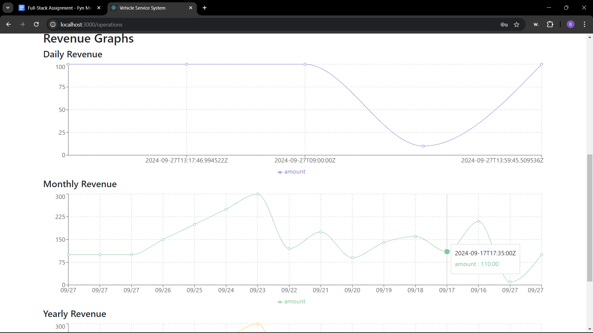

Here’s a basic `README.md` template for your project, explaining how to clone the repository and run both the frontend (React) and backend (Django) projects:

# Vehicle Service System

This repository contains the frontend (React) and backend (Django) code for a vehicle service system. The frontend is located in the `frontend` folder and the backend is in the `backend` folder.

## Prerequisites

Before getting started, make sure you have the following installed:

- [Python 3.x](https://www.python.org/downloads/)
- [Node.js and npm](https://nodejs.org/en/download/) (for React frontend)
- [Virtualenv](https://pypi.org/project/virtualenv/) (for Python virtual environment)

## Getting Started

### 1. Clone the Repository

```bash
git clone https://github.com/your-username/your-repo-name.git
cd your-repo-name
```

### 2. Running the Backend (Django)

1. Navigate to the `backend` folder:

   ```bash
   cd backend
   ```

2. Create and activate a virtual environment:

   ```bash
   virtualenv venv
   source venv/bin/activate  # For Linux/macOS
   venv\Scripts\activate  # For Windows
   ```

3. Install dependencies:

   ```bash
   pip install -r requirements.txt
   ```

4. Apply database migrations:

   ```bash
   python manage.py makemigrations
   python manage.py migrate
   ```

5. Run the Django development server:

   ```bash
   python manage.py runserver
   ```

Your Django backend will be running at `http://127.0.0.1:8000/`.

### 3. Running the Frontend (React)

1. Navigate to the `frontend` folder:

   ```bash
   cd ../frontend
   ```

2. Install dependencies:

   ```bash
   npm install
   ```

3. Start the React development server:

   ```bash
   npm start
   ```

Your React frontend will be running at `http://localhost:3000/`.

### 4. Accessing the Application

Once both the frontend and backend servers are running, you can open your browser and visit `http://localhost:3000/` for the frontend. The frontend will interact with the backend at `http://127.0.0.1:8000/`.

## Additional Commands

### Backend (Django)

- **Run Tests**:

  ```bash
  python manage.py test
  ```

- **Create Superuser**:

  ```bash
  python manage.py createsuperuser
  ```

## Screenshots

1. Page for operational users to add new components and price
   

2. After adding new components, list of components is shown
   

3. Page for customer users to add vehicles and issues
   

4. After submitting a list of issues, the final price is calculated
   

5. Alert showing payment is successful
   

6. Revenue graph for day, month and year
   
